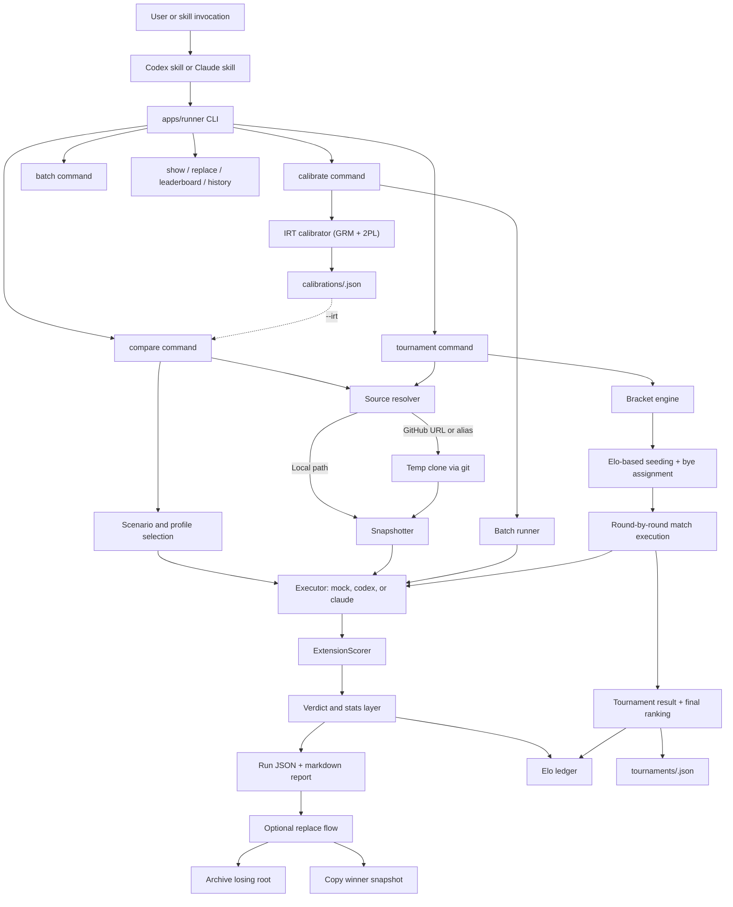
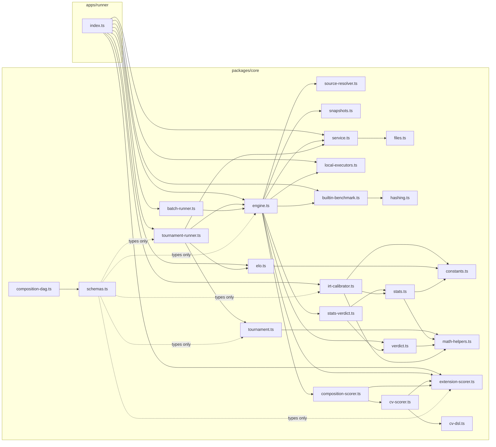

# Watchtower Architecture

Watchtower is a local benchmark pipeline for markdown skill libraries. The CLI is thin; the `core` package owns source resolution, snapshots, execution, scoring, statistics, Elo tracking, tournaments, reporting, and replacement.

## System Diagram



## Module Dependency Graph



## Subsystems

### Runner

`apps/runner` parses CLI flags, selects the executor, prints diagnostics, and dispatches into `packages/core`. It does not own business rules. Commands: `profiles`, `compare`, `composite`, `tournament`, `batch`, `calibrate`, `show`, `replace`, `leaderboard`, `history`.

### Source Resolver

`packages/core/src/source-resolver.ts` normalizes local inputs, Watchtower aliases, and GitHub inputs into local paths plus stable source metadata. Remote sources are cloned to temp directories and cleaned up after use.

### Snapshots

`packages/core/src/snapshots.ts` creates immutable per-run copies. The engine always evaluates snapshots, not live mutable roots.

### Benchmark Selection

`packages/core/src/builtin-benchmark.ts` defines four built-in benchmark profiles:

- **default** (process discipline): 8 tasks across 3 categories (structured_reasoning 35%, scope_discipline 35%, handoff_quality 30%). Tests whether skills improve LLM engineering output.
- **library-quality** (documentation review): 8 tasks across 4 categories. Diagnostic profile for skill file organization.
- **friction** (simplicity check): 3 tasks, 1 category. Ensures skills don't over-complicate simple work.
- **grounded** (objective accuracy): 4 deterministic tasks across 2 categories (reasoning_accuracy 40%, engineering_accuracy 60%). Known correct answers — no LLM-as-Judge subjectivity.

Scenarios are defined in `packages/core/src/schemas.ts` and influence comparison mode plus recommended profiles.

`packages/core/src/profile-loader.ts` provides the extensibility layer: custom profiles can be loaded from JSON files on disk, validated, and registered into the profile registry. Custom profiles define their own categories, weights, and tasks. The `extends_default` flag allows inheriting built-in tasks while adding custom ones. Category subsetting (`subsetProfileByCategories`) allows running a focused slice of any profile.

### Execution

`packages/core/src/local-executors.ts` provides:

- `mock` for deterministic local development
- `codex` for real Codex-backed runs
- `claude` for real Claude-backed runs

The runner selects a provider, resolves the launch shell for the host OS, and passes one instruction file plus one snapshot bundle into the provider command template.

### Scoring and Stats

`packages/core/src/verdict.ts` computes the baseline scorecard, winner, recommended action, Devil's Advocate result, and token tax penalties for excessively verbose output. `packages/core/src/composite.ts` provides cross-profile weighted composite scoring.

`packages/core/src/stats.ts` and `packages/core/src/stats-verdict.ts` layer in:

- Bayesian posterior summaries
- bootstrap confidence intervals (10,000 resamples, seeded PRNG)
- ROPE-style practical-difference reporting
- score stability indicators (CV thresholds)

### Tournament Engine

`packages/core/src/tournament.ts` provides bracket math: power-of-2 sizing, bye computation, standard seeding (Elo-first, deterministic random fallback via shared mulberry32 PRNG), bracket slot generation, and result rendering.

`packages/core/src/tournament-runner.ts` orchestrates execution in composable phases:

1. **initializeSeeds** — resolve sources, load Elo, assign seed numbers
2. **executeBracket** — run all rounds sequentially, each round producing matches and byes
3. **buildFinalRanking** — derive placement from match results (champion, runner-up, then elimination round + seed order)
4. **persistTournament** — write result JSON to `tournaments/`

Draws are resolved by seed advantage. Elo updates are skipped for seed-decided matches to prevent rating distortion.

### Evaluation Extensions 
Three research-backed evaluation extensions integrate through a unified `ExtensionScorer` interface. Each extension scores tasks after the base executor, without modifying engine.ts control flow.

`packages/core/src/extension-scorer.ts` defines the `ExtensionScorer` interface and registry. Scorers register explicitly at CLI startup. At most one extension per task. If a scorer throws, the base score is used (graceful degradation). Extension metadata (including `scorer_kind`) is attached to `TaskTrialResult.extension_metadata`.

`packages/core/src/irt-calibrator.ts` implements Item Response Theory calibration using the Graded Response Model (GRM, Samejima 1969) with 2PL fallback. The EM algorithm (Gauss-Hermite quadrature, Newton-Raphson M-step with Armijo line search and Hessian regularization) produces per-task Fisher Information weights. These weights adjust category contributions in `computeEnhancedScorecard()` — informative tasks count more, noisy tasks count less. IRT does not use ExtensionScorer; it modifies weights, not scores.

`packages/core/src/cv-scorer.ts` implements the Construction-Verification evaluation split. Construction cues are evaluated first; verification checks (expressed in a formal DSL) are evaluated against construction output with a configurable firewall. The DSL parser (`packages/core/src/cv-dsl.ts`) supports 6 atoms (`requires`, `absent`, `before`, `after`, `count`, `section`) and 3 combinators (`AND`, `OR`, `NOT`).

`packages/core/src/composition-scorer.ts` tests compositional abstraction: whether a skill library supports combined reasoning beyond isolated skills. Tasks are structured as primitives (individual skills), compositions (pairwise combinations), and meta (generalization tests). Collapse detection measures whether primitive skills score well but composed tasks fail, with configurable thresholds and normalized severity. `packages/core/src/composition-dag.ts` validates that composition task dependencies form a DAG (Kahn's algorithm, deterministic topological sort). Mock executor scores composition tasks via keyword presence (case-insensitive substring matching) — this is a directional signal, not semantic evaluation. Collapse detection requires at least 2 scored tasks per layer; with fewer, the result includes `insufficient_data: true`. Default thresholds (floor=0.6, ceiling=0.3) are preliminary and configurable per-profile via `collapse_config`.

`packages/core/src/batch-runner.ts` accumulates trial data for IRT calibration by running multiple comparison batches. Uses `Promise.allSettled` with a semaphore concurrency limiter (max 8 parallel). Graceful SIGINT handling; completed runs are persisted individually. Cost estimation displayed before real-executor batches; `--confirm` required for batches > 10 runs.

### Calibration Data Flow

```
watchtower batch → runs/<run-id>.json (accumulated trial data)
                        ↓
watchtower calibrate → calibrations/<profile>-<date>.json (IRT params + Fisher weights)
                        ↓
watchtower compare --irt <path> → IRT-weighted scorecard
```

Each artifact is immutable once written (atomic write via .tmp + rename). Calibration files coexist by date; rollback is achieved by passing a previous file to `--irt` or omitting the flag entirely (v4 unweighted behavior).

### Elo Tracking

`packages/core/src/elo.ts` implements standard Elo (K=32, starting 1500) with a flat-file JSON ledger. Used by both pairwise comparisons and tournament matches. Leaderboard and match history are queryable from the CLI.

### Persistence

`packages/core/src/service.ts` writes local state under `watchtower-data/`:

- `runs/` — structured comparison output (includes `extension_metadata` for extension-scored tasks)
- `reports/` — readable markdown reports with per-task detail
- `snapshots/` — immutable per-run copies
- `archives/` — archive-before-replace safety copies
- `tournaments/` — tournament bracket results
- `calibrations/` — IRT calibration reports (`<profile>-<date>.json`)
- `elo.json` — leaderboard and history state

### Replacement

Replacement is a second step, not part of the comparison itself. For a replace-eligible same-library run, Watchtower:

1. archives the losing local root
2. preserves `.git`
3. copies the winner snapshot into the target root

Replacement is blocked for GitHub and alias-backed sources even when they benchmark successfully.

## Boundary Summary

What Watchtower is:

- a local benchmark for markdown skill libraries
- a repeatable compare-and-decide workflow with tournament support
- a tool that can be invoked from either Codex or Claude skills
- a psychometric task calibration engine (IRT weights reduce noise from uninformative tasks)
- a formal property verifier for skill library outputs (Construction-Verification with DSL)
- a compositional abstraction tester (detects whether libraries support combined reasoning)

What Watchtower is not:

- a web product
- a general repository quality platform
- a per-file or per-skill merge engine
- a multi-agent coordination benchmark
- a scaling law forecaster