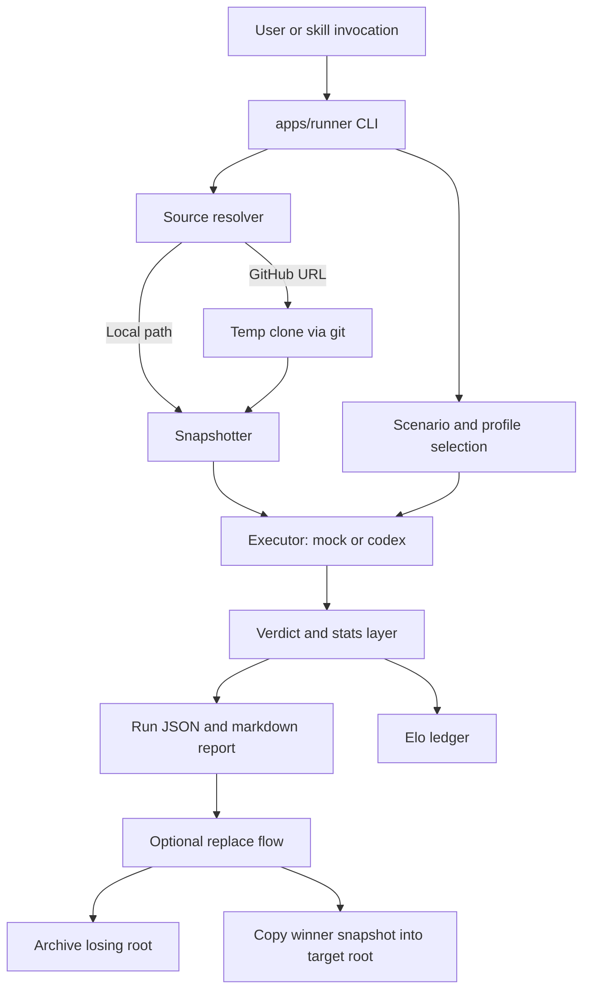

# Watchtower Architecture

Watchtower is a local benchmark pipeline for markdown skill libraries. The CLI is thin; the `core` package owns source resolution, snapshots, execution, scoring, statistics, Elo tracking, reporting, and replacement.

## Subsystems

### Runner

`apps/runner` parses CLI flags, selects the executor, and dispatches into `packages/core`. It does not own business rules.

### Source Resolver

`packages/core/src/source-resolver.ts` normalizes local inputs and GitHub inputs into local paths. GitHub sources are cloned to temp directories and cleaned up after use.

### Snapshots

`packages/core/src/snapshots.ts` creates immutable per-run copies. The engine always evaluates snapshots, not live mutable roots.

### Benchmark Selection

`packages/core/src/builtin-benchmark.ts` defines bundled benchmark profiles and packs. Scenarios are defined in `packages/core/src/schemas.ts` and influence comparison mode plus recommended profiles.

### Execution

`packages/core/src/local-executors.ts` provides:

- `mock` for deterministic local development
- `codex` for real Codex-backed runs

The engine runs every task against both sides for five trials per side.

### Scoring and Stats

`packages/core/src/verdict.ts` computes the baseline scorecard, winner, recommended action, and Devil's Advocate result.

`packages/core/src/stats.ts` and `packages/core/src/stats-verdict.ts` layer in:

- Bayesian posterior summaries
- bootstrap confidence intervals
- ROPE-style practical-difference reporting
- score stability indicators

### Persistence

`packages/core/src/service.ts` writes local state under `watchtower-data/`:

- `runs/`
- `reports/`
- `snapshots/`
- `archives/`
- `elo.json`

### Replacement

Replacement is a second step, not part of the comparison itself. For a replace-eligible same-library run, Watchtower:

1. archives the losing local root
2. preserves `.git`
3. copies the winner snapshot into the target root

## Boundary Summary

What Watchtower is:

- a local benchmark for markdown skill libraries
- a repeatable compare-and-decide workflow

What Watchtower is not:

- a web product
- a general repository quality platform
- a per-file or per-skill merge engine
